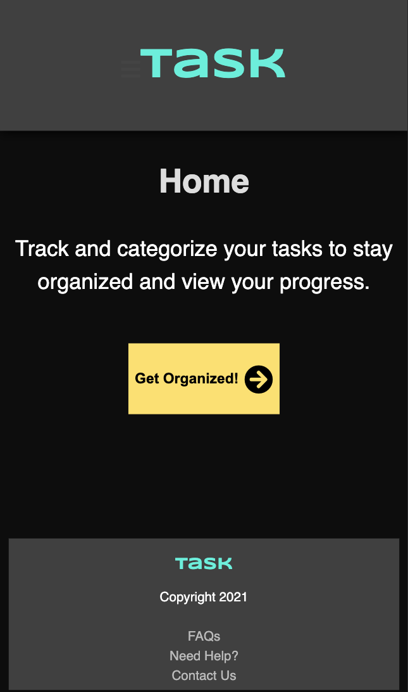
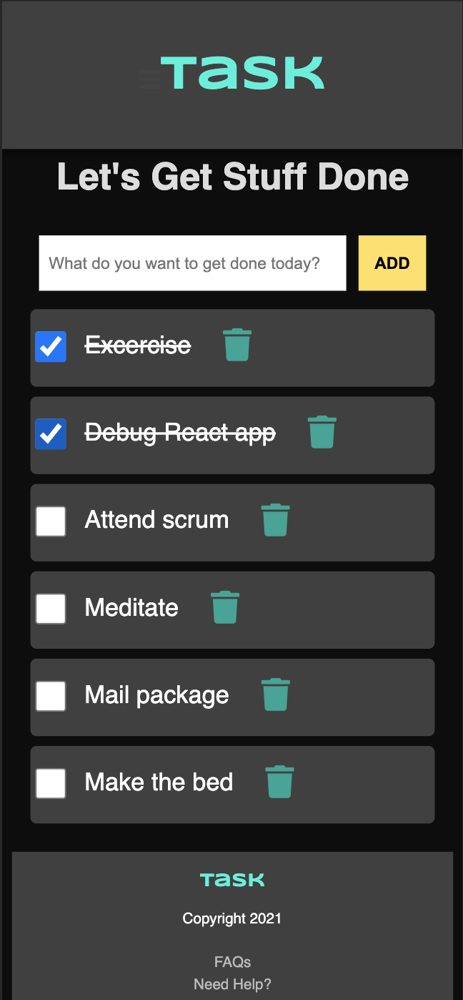

# Task client

## Overview
This app was built for people to track completion of their daily tasks and remain productive.

## Features
Add, check, and delete daily tasks.

## Running the project locally
Live version: https://task-client-bluwakpa.vercel.app/

Repository: https://github.com/bluwakpa/task-client

1. Clone the project locally
2. Install dependancies `npm install`
3. Start the application `npm start`

## Tech Stack
React
Node
Express
PostgreSQL

## API Documentation

Live version: https://frozen-crag-61297.herokuapp.com

| Method | URL  | Success  | Error |
| :-----: | :-: | :-: | :-: |
| GET | /api/tasks | 200 | 400 |
| POST | / | 201 | 400 |
| DELETE | /:id | 204 | 400 |
| PATCH | /:id | 204 | 400 |

## Features Todo
1. Checkbox Color Redesign
2. Button Hover Features
4. Complete Header Hamburger Menu

## Screenshots

